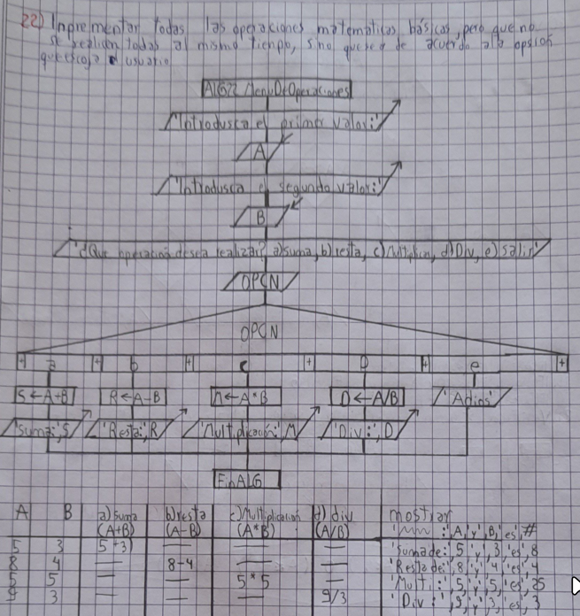
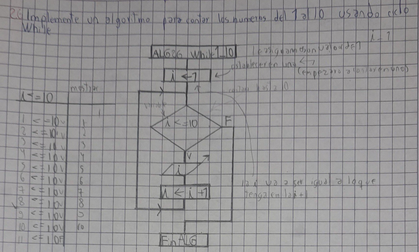

# Introduccion a la Informatica *(INF-110)*

En esta materia se enseño sobre la historia de la informatica, como parte teorica y como parte practica se enseño en lenguaje ***PASCAL***
*la logica de las variables, condicionales, bucles, switch, case.*

El programa que se utilizo fue *Lazarus* para experimentar con estas logicas sencillas.
